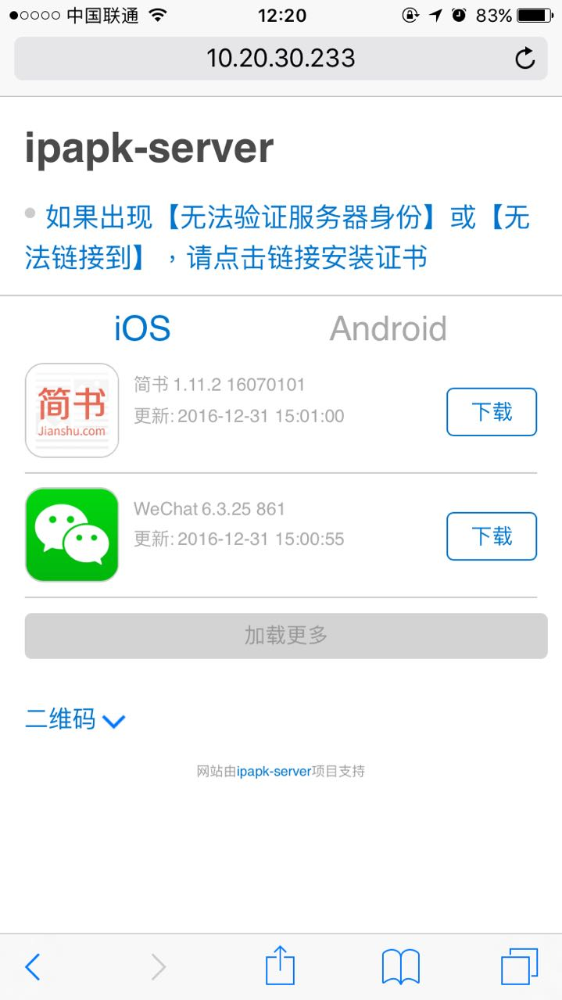
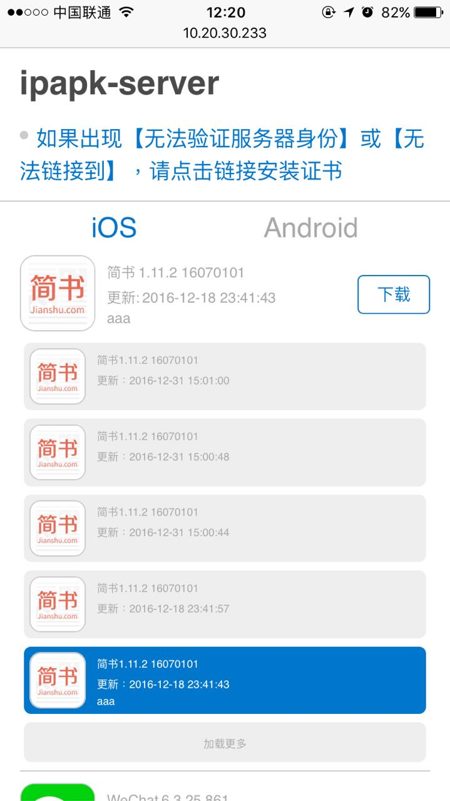

# 简介
自动生成自签名HTTPS服务器，可以快速安装ipa、apk，基于[ios-ipa-server](https://github.com/bumaociyuan/ios-ipa-server)开发

# 支持
* OS X
* Ubuntu
* CentOS 7
* 其他平台未测试

# 需要
* [nodejs](https://nodejs.org/)
* gcc

0.2.9版本 以上需要浏览器支持ES6

# 安装
```
$ npm install -g ipapk-server
```

国内可能无法访问S3，使用淘宝镜像下载预编译的sqlite3（Ubuntu下镜像无效）
```
$ npm install -g ipapk-server --node_sqlite3_binary_host_mirror=https://npm.taobao.org/mirrors
```

Ubuntu 64 bit 需要另外安装

```
sudo apt-get install libc6-i386 lib32stdc++6 lib32gcc1 lib32ncurses5
sudo apt-get install lib32z1
```

CentOS 7 64 bit 需要另外安装

```
 yum install zlib.i686 libstdc++.i686
```

# 用法
```
Usage: ipapk-server [option]

Options:

-h, --help                output usage information
-V, --version             output the version number
-p, --port <port-number>  set port for server (defaults is 1234)
-h, --host <host>     set host for server (defaults is your LAN ip)
```

## 开启服务
```
$ ipapk-server

# 推荐使用pm2/forever等进程管理运行服务
```

## 下载
手机浏览器中打开 `https://ip:port/`
> - 记得输https  
> - iOS下载一定要使用Safari
### 注意
iOS 10.3后 默认不信任安装的证书，需要手动信任。
> 设置 > 通用 > 关于 > 证书信任设置 > 对需要的证书启用完全信任



该项目提供了默认的web下载页面，同时也提供了API，方便集成到其他平台。

## API
### 包上传
path:

```
POST /upload
```

param:

```
package:安装包文件, reqiured
changelog:ChangeLog, optional
```
response:

```
{
  platform: 'ios',
  build: '1608051045',
  bundleID: 'com.jianshu.Hugo',
  version: '2.11.4',
  name: 'Hugo',
  guid: '46269d71-9fda-76fc-3442-a118d6b08bf1'
}
```
命令行:`curl 'https://ip:port/upload' -F "package=@文件路径" -F "changelog=xxx" --insecure`，不能去掉`@`

### 所有App
path:

```
GET /apps/:platform/:page
```
params:

```
:platform: ios or android
:page: 分页，默认1
```
response:

```
[
	{
		id: 6,
		guid: "46269d71-9fda-76fc-3442-a118d6b08bf1",
		bundleID: "com.jianshu.Hugo",
		version: "2.11.4",
		build: "1608051045",
		icon: "https://10.20.30.233:1234/icon/46269d71-9fda-76fc-3442-a118d6b08bf1.png",
		name: "Hugo",
		uploadTime: "2016-12-01 20:50:05",
		platform: "ios",
		url: "itms-services://?action=download-manifest&url=https://10.20.30.233:1234/plist/46269d71-9fda-76fc-3442-a118d6b08bf1",
		changelog: "add feature"
	},
	{
		id: 3,
		guid: "baac66f0-0e7b-f72c-40e3-378aab26fd9b",
		bundleID: "com.jianshu.victor",
		version: "1.1.0",
		build: "1611251530",
		icon: "https://10.20.30.233:1234/icon/baac66f0-0e7b-f72c-40e3-378aab26fd9b.png",
		name: "Victor",
		uploadTime: "2016-11-26 20:47:43",
		platform: "ios",
		url: "itms-services://?action=download-manifest&url=https://10.20.30.233:1234/plist/baac66f0-0e7b-f72c-40e3-378aab26fd9b",
		changelog: "bug fix"
	}
]
```
### 某个App的所有版本
path:

```
/apps/:platform/:bundleID/:page
```
params:

```
:platform: ios or android
:bundleID: app bundleID
:page: 分页，默认1
```
response:

```
[
	{
		id: 5,
		guid: "a8573b7a-18bc-1925-f2b4-8842db2153aa",
		bundleID: "com.jianshu.Hugo",
		version: "2.11.4",
		build: "1608051045",
		icon: "https://10.20.30.233:1234/icon/a8573b7a-18bc-1925-f2b4-8842db2153aa.png",
		name: "Hugo",
		uploadTime: "2016-11-26 21:00:51",
		platform: "ios",
		url: "itms-services://?action=download-manifest&url=https://10.20.30.233:1234/plist/a8573b7a-18bc-1925-f2b4-8842db2153aa",
		changelog: "add feature"
	},
	{
		id: 6,
		guid: "46269d71-9fda-76fc-3442-a118d6b08bf1",
		bundleID: "com.jianshu.Hugo",
		version: "2.11.4",
		build: "1608051045",
		icon: "https://10.20.30.233:1234/icon/46269d71-9fda-76fc-3442-a118d6b08bf1.png",
		name: "Hugo",
		uploadTime: "2016-12-01 20:50:05",
		platform: "ios",
		url: "itms-services://?action=download-manifest&url=https://10.20.30.233:1234/plist/46269d71-9fda-76fc-3442-a118d6b08bf1",
		changelog: "add feature"
	}
]
```
# SSL 证书
该项目默认使用自签名的证书，如果你有正规CA颁发的证书，可替换`~/.ipapk-server`目录下的证书。


# TODO
- token验证
- 国际化支持

# 贡献
[zhao0](https://github.com/zhao0)、[mask2](https://github.com/mask2)
